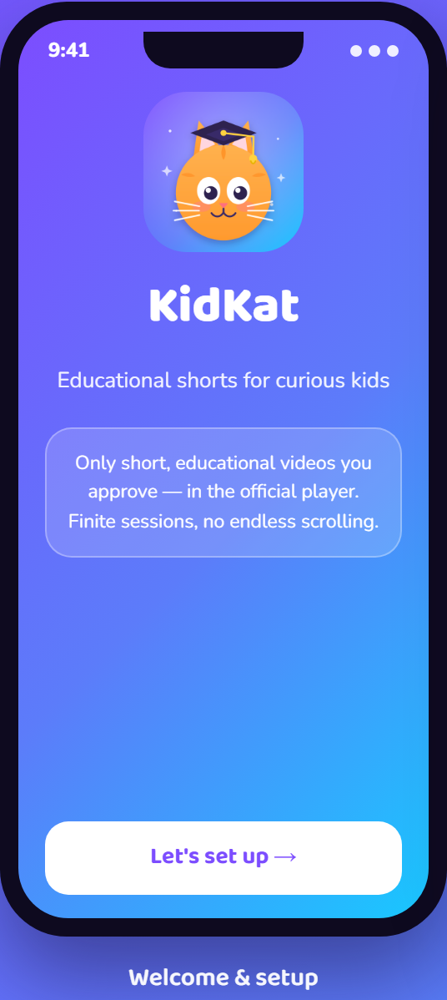
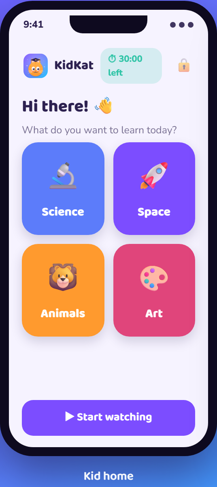
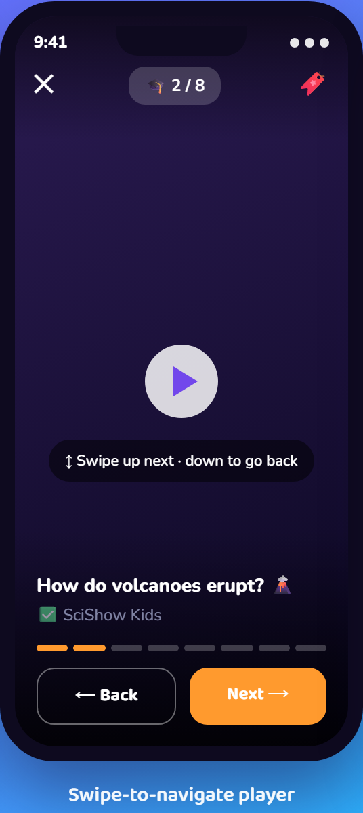
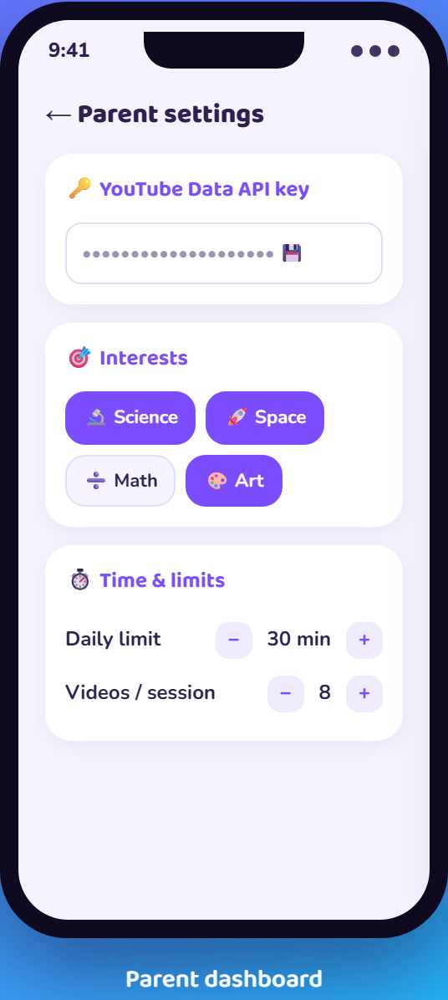
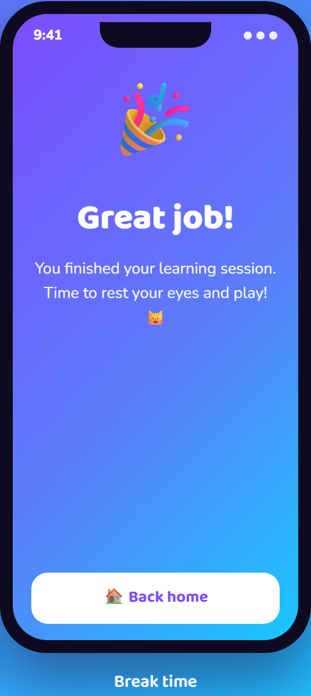
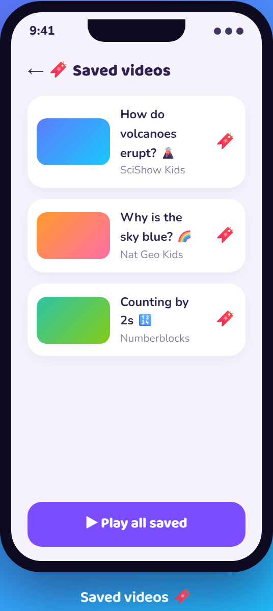

<div align="center">


# KidKat

**Educational shorts for curious kids — without the doomscroll.**

[](https://naveenneog.github.io/KidKat/)
[](https://github.com/naveenneog/KidKat/releases/latest)
[](https://flutter.dev)
[](LICENSE)

</div>

KidKat is a cross-platform (Android + iOS) Flutter app that gives children a safe,
**finite** stream of short *educational* videos chosen by their parents. It is a
curated front-end built entirely on official, permitted YouTube building blocks.

## 📱 Screenshots

<p align="center">
  
  
  
  
  
  
</p>

> ▶️ **Explore the interactive site:** https://naveenneog.github.io/KidKat/

---

## ✅ Is this within YouTube's Terms? (read this first)

The original idea — "log into a YouTube **Kids** account and override the YouTube
algorithm" — is **not** possible or permitted:

| Requested behaviour | Status | Why |
| --- | --- | --- |
| Log into a YouTube **Kids** account | ❌ Not possible | There is **no public YouTube Kids API**. Kids accounts are COPPA-restricted and cannot be accessed by third parties. |
| Override YouTube's recommendation algorithm | ❌ Not allowed | The [YouTube API Services ToS](https://developers.google.com/youtube/terms/api-services-terms-of-service) forbid interfering with recommendations or building a *substitute* client. |
| Custom video playback / stream extraction | ❌ Not allowed | Apps **must** use the official embedded player; ripping/re-serving streams is prohibited. |

**KidKat takes the compliant path that achieves the same real goal:**

- 🔎 **Discovery** via the official **YouTube Data API v3** (search + metadata only).
- ▶️ **Playback** via the official **YouTube IFrame player** (`youtube_player_iframe`) —
  no stream extraction, creators keep their views/monetization.
- 🧩 **Our own curation**, not YouTube's — a parent allowlist plus an
  Education/Science category filter. We never read or alter YouTube's algorithm.
- 🚫 **No Kids-account login.** All profiles/controls live on-device; **no child PII** is collected.

## 🛡️ Anti-doomscroll by design

- **Finite sessions** — a fixed number of videos per session, then a *break* screen. No infinite feed.
- **Daily time limit** — when it's reached, the app locks until tomorrow (parent can extend).
- **Swipe-friendly player** — swipe **up = next**, **down = previous** (plus tap to pause and clear Back/Next buttons), all within a **finite** session; related-video suggestions are restricted to the same channel.
- **Parent PIN gate** on all settings.
- **Strict Safe Search**, **embeddable-only**, **short-only** (≤1 min or ≤4 min) filtering.

## ✨ Features

- 🐱 Friendly 3D graduate-cat branding, kid-first UI (big tiles, rounded everything).
- 📲 **Swipe up/down** to change videos (works over the YouTube player), tap to pause, Back/Next buttons.
- 🔖 **Bookmark & Saved videos** — save favorites and replay them from a Saved screen.
- 🔁 **No repeats** — already-watched videos are skipped in future sessions.
- 🎨 **5 colorful themes** (Purple Pop, Candy Bright, Ocean, Sunset, Forest).
- 🧒 **Age bands** (3–5 / 6–8 / 9–12) pre-load age-appropriate trusted channels and bias searches.
- 👪 Parent dashboard: API key (guided setup), interests, **approved-channel allowlist**, daily limit, videos-per-session, video length, Safe Search, reset today's time.
- 🎓 12 learning interests (Science, Space, Animals, Math, Reading, Nature, Art, Music, Coding, Geography, History, Human Body).
- ⏱️ Live "time left today" indicator.

## 🚀 Getting started

### Prerequisites
- Flutter (stable). Android SDK for Android; macOS + Xcode for iOS.

### Get a YouTube Data API key (free)
1. Go to <https://console.cloud.google.com> → create/select a project.
2. **APIs & Services → Library →** enable **YouTube Data API v3**.
3. **APIs & Services → Credentials → Create credentials → API key**.
4. Paste the key into KidKat's first-run setup (or Parent settings).

### Run
```bash
flutter pub get
flutter run            # Android device/emulator or iOS simulator
```

### Build
```bash
flutter build apk            # Android
flutter build appbundle      # Android (Play Store)
flutter build ios            # iOS (on macOS)
```

### Regenerate icons / splash (after changing brand assets)
```bash
cd tool/icongen && npm install && node generate.js && cd ../..
dart run flutter_launcher_icons
dart run flutter_native_splash:create
```

## 🧪 Tests

```bash
flutter analyze
flutter test
```

Covers ISO-8601 duration parsing, the educational/duration/dedup curation filter,
the Data API client (with a mocked HTTP client incl. quota/invalid-key handling),
local persistence + daily watch-time accounting, end-to-end session building, and
onboarding widget smoke tests.

## 🏗️ Architecture

```
lib/
  core/        constants, theme, router, duration utils
  data/        youtube_api · curation_service · local_store · providers (Riverpod)
    models/    topic · kid_video · allowlisted_channel · parent_config
  features/
    onboarding/  first-run parent setup
    parent/      PIN gate · dashboard
    kid/         home · session player · break · time-up
  widgets/     brand components
```

- **State:** Riverpod. **Routing:** go_router (onboarding redirect + parent gate).
- **Discovery:** `YouTubeApi` (search → videos hydrate, embeddable-only).
- **Curation:** `CurationService.buildSession` → finite, filtered, de-duplicated queue.

## ⚖️ Privacy & compliance notes

- No account login; no analytics/ads SDKs; no child PII.
- The parent's API key and PIN are stored locally on the device only.
- Intended to operate within the YouTube API Services Terms and child-privacy
  norms (COPPA/GDPR-K). Review platform policies before publishing to stores.

## 📄 License

**KidKat is free for non‑commercial use** under the
[PolyForm Noncommercial License 1.0.0](LICENSE) — you may use, modify, and
share it for any noncommercial purpose (personal, educational, research,
non‑profit, government). **Commercial use is not permitted** without a separate
license. See [`LICENSE`](LICENSE) for the full terms.

> Note: this covers KidKat's own code. YouTube content played in the app remains
> subject to YouTube's Terms and the respective creators' rights.
